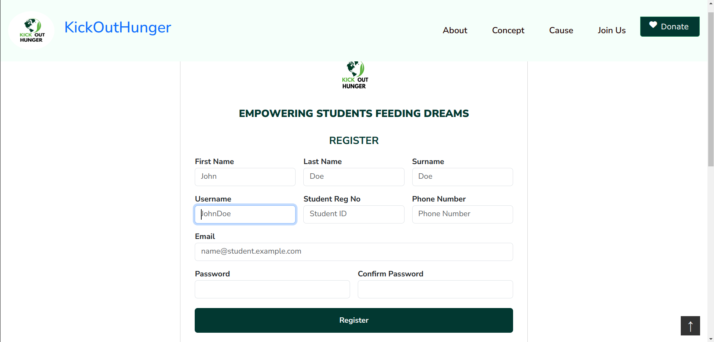
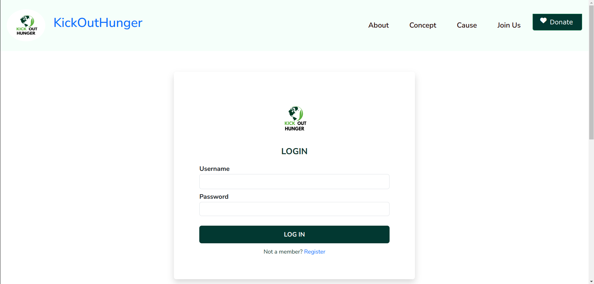

# KickOutHunger

## Table of Content

+ [Description](#description)
+ [Installation Requirement](#installation-requirements)
+ [Technology Used](#technologies-used)
+ [License](#license)
+ [Authors Info](#authors-info)

## Description
Kick Out Hunger is an organization that is aimed at ending Campus Hunger. We recognize that due to the prevailing hard economic times a lot of students in Universities  are going without daily consistent meals. This misfortune has led to students performing poorly or dropping out of school. 

- Kenyan university students face significant food security challenges, with many struggling to afford nutritious meals due to high tuition fees and living expenses. 

- This financial strain often forces students to skip meals or rely on inadequate, low-cost food options. The lack of consistent access to healthy food affects their academic performance and overall well-being. 

- Addressing this issue is crucial to ensuring that students can focus on their studies and achieve their full potential.

## User Stories

Student Can :-

* Register in the application.
* Login to the application.
* Use a financial Wallet to pay for meals.

Admin can :-
* Activate student accounts and send mail/notifications.
* Add users .
* Generate reports.

[Go Back to the top](#kickouthunger)

**Registration**
- Capturing of student details.

**Login**
- After account activation student can login.

# how to work on this project
## clone
- git clone https://github.com/INUKA-PLATFORM/INUKA-PROJECT.git
- cd INUKA-PROJECT
## Ensure that
- You have python installed into your machine
## To create a virtual environment use the following command
- python -m venv myenv
## TO start the environment 
- myenv/Scripts/activate
## To install dependencies i.e django
- pip install django
## to run the the app
- python manage.py runserver
## Technologies used 
- Python - Django
- HTML
- CSS

[Go Back to the top](#kickouthunger)
